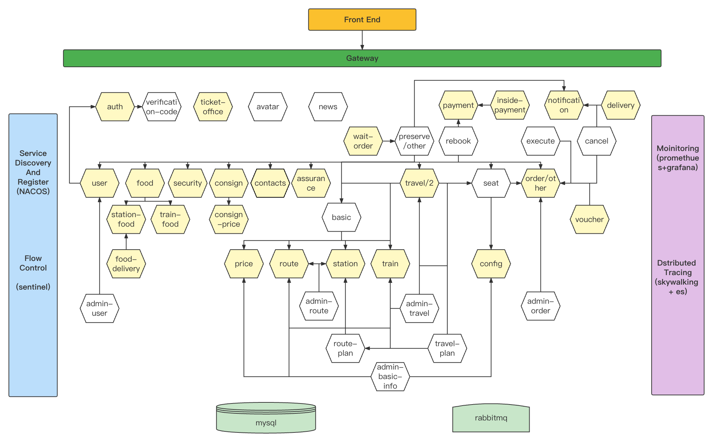
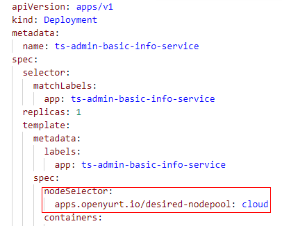
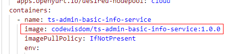
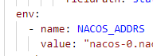

# Train Ticket：A Benchmark Microservice System
# 
基于复旦大学的trainticket项目[Wiki Pages](https://github.com/FudanSELab/train-ticket/wiki). 
## 服务结构图

## 基于之前的train ticket在集群中安装步骤
1.在每个服务的Dockerfile中添加代码，接入自己的追踪工具
 ``` 
ADD https://github.com/open-telemetry/opentelemetry-java-instrumentation/releases/latest/download/opentelemetry-javaagent.jar /usr/local/opentelemetry-javaagent.jar
RUN chmod 644 /usr/local/opentelemetry-javaagent.jar
ENV JAVA_TOOL_OPTIONS="-javaagent:/usr/local/opentelemetry-javaagent.jar" \
    OTEL_TRACES_EXPORTER=jaeger \
    OTEL_EXPORTER_JAEGER_ENDPOINT=http://172.26.146.180:14250 \
    OTEL_EXPORTER_JAEGER_TIMEOUT=100000 \
    OTEL_METRICS_EXPORTER=prometheus \
    OTEL_LOGS_EXPORTER=logging
  ``` 
2.打包并生成服务镜像  
### 注：ts-avatar-service无法打包成镜像，在服务结构图中，它是单独存在的，不需要它的trace，故这个服务的镜像使用的是复旦大学实验室的镜像，该服务文件夹更名为fail-ts-avatar-service
```bash
cd train-ticket
make build
```  
可修改Makefile文件中以下两个变量，更改生成的镜像名字和标签  
```
Repo=habor.production.horsecoder.com/hybrid
Tag=1.0.0
```
3.推镜像到habor库  
首先要用docker login登录一下我们的私有镜像库  
 
```
docker login https://habor.production.horsecoder.com
```
接着执行
```
make push
```
可修改/hack/push-image2.sh更改推镜像的细节  

4.修改deployment/kubernetes-manifests/quickstart-k8s/yamls/deploy.yaml  
将微服务全部部署在云节点上  
  
更改镜像来源为自己私有库里的镜像  
  
修改变量NACOS-ADDRS的值，使用集群中已有的注册中心  
  
```
"nacos-0.nacos-headless.nacos.svc.cluster.local,nacos-1.nacos-headless.nacos.svc.cluster.local,nacos-2.nacos-headless.nacos.svc.cluster.local"
```
5.修改deployment/kubernetes-manifests/quickstart-k8s/yamls/secret.yaml中变量的值，接入我们自己的数据库
```
  ASSURANCE_MYSQL_HOST: "test-database-horsecoder-com.horsecoder-test.svc.cluster.local"
  ASSURANCE_MYSQL_PORT: "3306"
  ASSURANCE_MYSQL_DATABASE: "trainticket"
  ASSURANCE_MYSQL_USER: "root"
  ASSURANCE_MYSQL_PASSWORD: "28732b0415c142af"
```
6.部署服务  
```
kubectl apply -f deployment/kubernetes-manifests/quickstart-k8s/yamls/secret.yaml -n trainticket
kubectl apply -f deployment/kubernetes-manifests/quickstart-k8s/yamls/svc.yaml -n trainticket
kubectl apply -f deployment/kubernetes-manifests/quickstart-k8s/yamls/deploy.yaml -n trainticket
```
